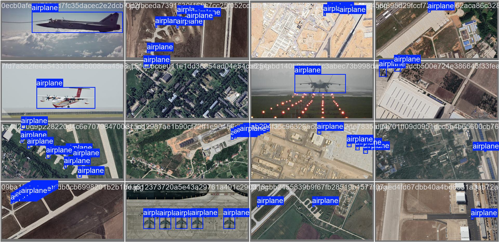
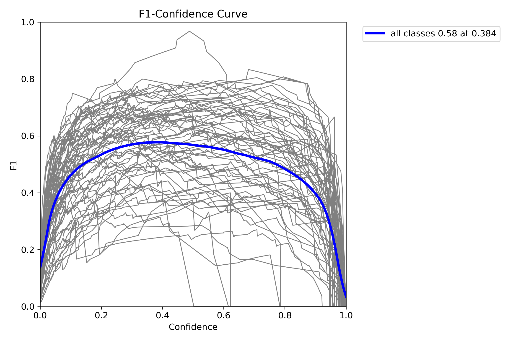
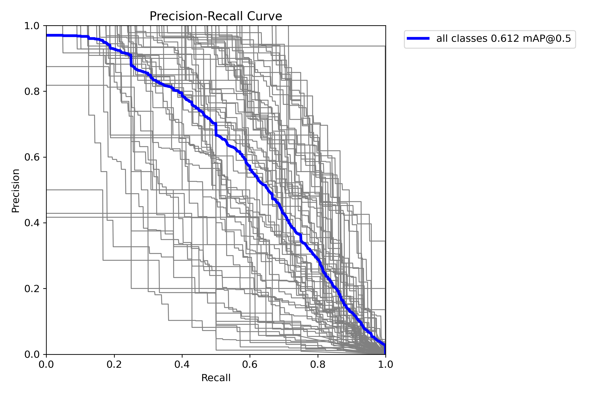
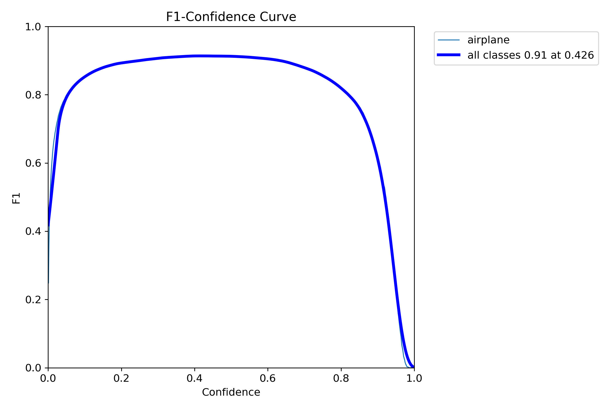
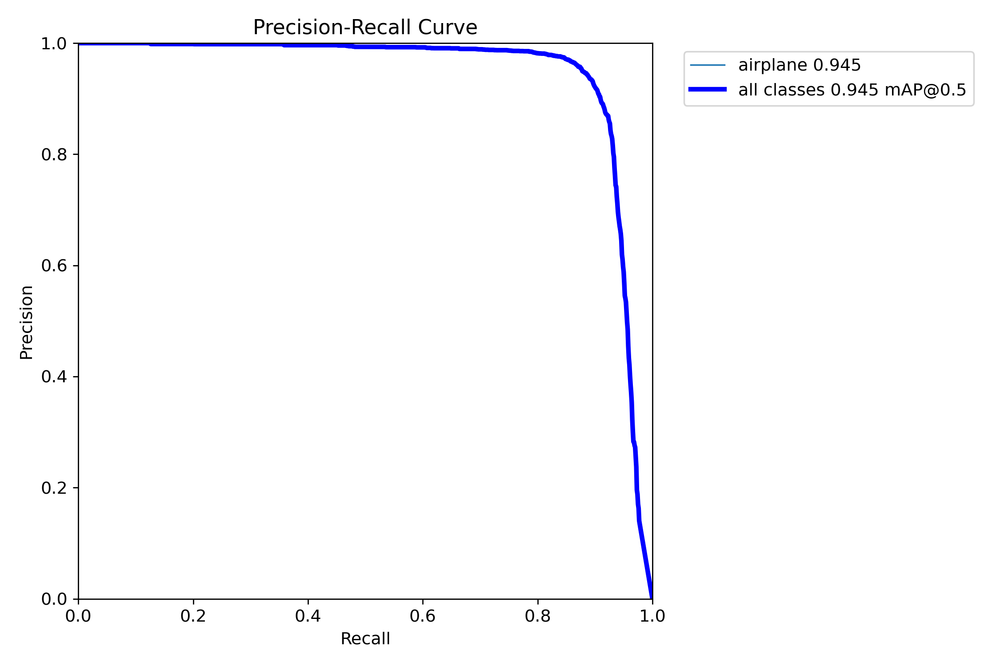

# Aircraft Orientation Detection using YOLOv5

This project focuses on detecting the orientation of military aircraft using YOLOv8. The system is designed to identify aircraft in images and provide annotations indicating their position and identification confidence.

## Demo

You can watch a demo of the project in action [here](https://www.youtube.com/watch?v=iqSWaV8TZCo).

Here is a set of classified images using the first-phase model:

## Dataset

The dataset used for training and testing includes labeled images of military aircraft from [Kaggle](https://www.kaggle.com/datasets/a2015003713/militaryaircraftdetectiondataset). These images have been preprocessed and converted to YOLO format for training.

## Project Structure and Design
The program first loads the trained YOLOv8 model for object detection, configured with a confidence threshold and Intersection Over Union threshold for precise detection.
It also loads a MobileNetV2 model trained to classify various military aircraft based on the detected objects.

The program opens a video file and captures frames to process.

Before detecting objects, the program checks for significant scene changes by comparing the color histograms of consecutive frames. If a scene change is detected, it clears the tracking and classification histories to avoid carrying over data from the previous scene.

The model detects airplanes in each frame of the video and assigns a unique ID to each detected object. The program keeps track of these objects and updates their detection history across frames.

For each detected airplane, the corresponding image region is cropped and classified using the MobileNetV2 model. The model predicts the type of aircraft and provides a confidence score for each prediction.
The program uses a history-based approach to stabilize classifications for each object.

If a new classification is detected, the program waits for several frames to confirm the change before updating the label. This reduces the likelihood of false label changes due to short-term misclassifications.

The program draws a bounding box around each detected airplane and labels it with the identified aircraft type. If the classification is still ongoing, the box is drawn in yellow with a label of "Identifying." Once a classification is confirmed, the box is drawn in green with the aircraft type and confidence percentage displayed.

The processed video frames, with bounding boxes and labels, are saved to an output file (output_video.mp4). The processed video is also displayed in real-time, and users can terminate the process by pressing the 'q' key.

## One-step Vs. Two-Step Model Performance
Here are the training validation stats for the one-step model.

Here are the training validation stats for the two-step model. As shown, the classification confidence, precision, and recall are significantly more stable and accurate.

